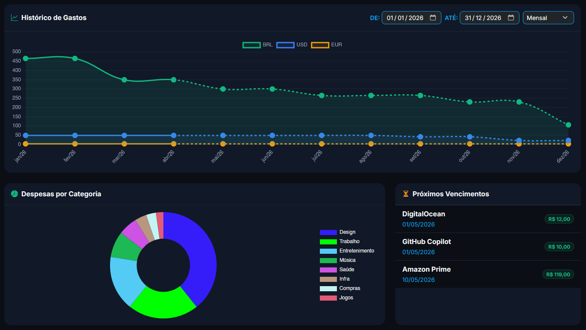

# 🛡️ Minhas Assinaturas

O **Minhas Assinaturas** é uma plataforma robusta e privativa para o gerenciamento total de assinaturas digitais, licenciamentos de software e serviços recorrentes. Desenvolvido com foco absoluto em segurança e privacidade do usuário, o sistema permite que você retome o controle financeiro dos seus serviços digitais em um único lugar.



## 🌟 Diferenciais e Funcionalidades

- **Controle de Vencimentos:** Nunca mais seja pego de surpresa por renovações automáticas. Receba alertas precisos antes de qualquer cobrança.
- **Gráficos Analíticos:** Visualize seu orçamento mensal e anual com projeções inteligentes de gastos.
- **Importação Facilitada:** Suporte para importação manual e via planilhas CSV para migração rápida de dados.
- **Privacidade por Design:** Arquitetura de banco de dados isolada garantindo anonimato total: administradores visualizam dados de serviços mas nunca sabem a quem eles pertencem.
- **Segurança Avançada:** Proteção contra ataques de força bruta, autenticação de dois fatores (2FA) e logs de auditoria detalhados.
- **Interface Premium:** Design moderno em Dark Mode com Bootstrap 5.3 e componentes reativos Livewire 4.

## 🔐 Arquitetura de Privacidade (O Coração do Projeto)

O sistema utiliza uma camada de indireção entre o usuário e suas assinaturas. Em vez de relacionar assinaturas diretamente ao `user_id`, utilizamos **Privacy Tokens (UUIDs)** aleatórios.

1. As assinaturas são vinculadas apenas a um token UUID único.
2. A tabela de assinaturas não possui referência direta ao usuário.
3. Administradores possuem uma **Visão Anonimizada**: eles visualizam todos os serviços e valores para fins de gestão do sistema, mas não há qualquer vínculo técnico que permita identificar o proprietário de cada registro.

## 🛠️ Stack Tecnológica

- **Backend:** [Laravel 13](https://laravel.com) + PHP 8.5
- **Frontend Reativo:** [Livewire 4](https://livewire.laravel.com) + [Alpine.js](https://alpinejs.dev)
- **UI Framework:** [Bootstrap 5.3 Dark Mode](https://getbootstrap.com)
- **Banco de Dados:** MariaDB 11.x
- **Autenticação:** Laravel Fortify (TOTP / 2FA)
- **Relatórios:** [Chart.js 4](https://www.chartjs.org)
- **Importação:** [Maatwebsite Excel](https://docs.laravel-excel.com)
- **Auditoria:** [Spatie Activity Log](https://spatie.be/docs/laravel-activitylog)

## 🚀 Como Executar o Projeto

Siga os passos abaixo para configurar o ambiente de desenvolvimento local:

### 1. Clonar e Acessar
```bash
git clone https://github.com/cstavares/gerenciamento-assinaturas.git
cd gerenciamento-assinaturas
```

### 2. Instalar Dependências
```bash
# Backend (PHP)
composer install

# Frontend (Node.js)
npm install
```

### 3. Configuração de Ambiente
```bash
# Criar o arquivo .env
cp .env.example .env

# Gerar chave da aplicação
php artisan key:generate
```

> [!IMPORTANT]
> Abra o arquivo `.env` e configure suas credenciais de Banco de Dados (`DB_DATABASE`, `DB_USERNAME`, `DB_PASSWORD`).

### 4. Banco de Dados e Seeders
Este comando criará as tabelas e o usuário administrador padrão:
```bash
php artisan migrate --seed
```
*As credenciais do admin padrão podem ser configuradas no `.env` (`ADMIN_EMAIL` e `ADMIN_PASSWORD`).*

### 5. Compilação e Execução
```bash
# Compilar assets (Vite)
npm run build

# Iniciar servidor local
php artisan serve
```
Acesse a aplicação em: `http://localhost:8000`

## 🧪 Testes

O projeto utiliza **TDD (Test Driven Development)** rigoroso. Atualmente, a suíte conta com 142 testes validados.

```bash
php artisan test
```

## ⚡ Performance

- **Blaze Engine:** Implementado folding de componentes para renderização ultra-rápida.
- **Navegação SPA:** `wire:navigate` ativo em todas as rotas principais.

## 📄 Licença

Este projeto está sob a licença MIT. Veja o arquivo [LICENSE](LICENSE) para mais detalhes.

---
Pensado por **Humanos**, desenvolvido por **IA** e ajustado novamente por **Humanos**.
